# Ticketradar - 机票监控系统

> [根目录](.) > **Ticketradar**

## 项目愿景

Ticketradar是一个基于FastAPI的智能机票监控和AI旅行规划系统，致力于为用户提供最优质的机票搜索、价格监控和智能旅行建议服务。

## 架构总览

### 技术栈
- **后端框架**: FastAPI (Python)
- **数据库**: Supabase (PostgreSQL)
- **缓存**: Redis
- **AI服务**: Gemini (通过OpenAI兼容API)
- **航班数据**: smart-flights库集成
- **部署**: Docker + Nginx + SSL
- **认证**: JWT + Supabase Auth

### 核心特性
- 🤖 **AI增强搜索**: 三阶段智能搜索（Google Flights + Kiwi + AI分析）
- 📊 **实时监控**: 自动化价格监控和通知
- 🌐 **多语言支持**: 中英文界面
- 💰 **价格追踪**: 智能价格变动检测
- 🚀 **高性能**: 异步处理 + 缓存优化
- 🔒 **安全可靠**: JWT认证 + HTTPS

## 模块结构图

```mermaid
graph TD
    A["(根) Ticketradar"] --> B["fastapi_app"];
    A --> C["基础设施"];
    
    B --> D["config"];
    B --> E["models"];
    B --> F["routers"];
    B --> G["services"];
    B --> H["dependencies"];
    B --> I["middleware"];
    B --> J["utils"];
    B --> K["prompts"];
    
    D --> L["settings.py"];
    D --> M["logging_config.py"];
    D --> N["supabase_config.py"];
    
    E --> O["flights.py"];
    E --> P["auth.py"];
    E --> Q["monitor.py"];
    E --> R["common.py"];
    
    F --> S["flights.py"];
    F --> T["auth.py"];
    F --> U["monitor.py"];
    F --> V["admin.py"];
    
    G --> W["flight_service.py"];
    G --> X["ai_flight_service.py"];
    G --> Y["monitor_service.py"];
    G --> Z["supabase_service.py"];
    G --> AA["cache_service.py"];
    G --> AB["async_task_service.py"];
    G --> AC["notification_service.py"];
    G --> AD["user_service.py"];
    
    C --> AE["docker-compose.yml"];
    C --> AF["Dockerfile"];
    C --> AG["nginx.conf"];
    C --> AH["auto_deploy.sh"];
    C --> AI["ssl/"];
    
    click B "./fastapi_app/CLAUDE.md" "查看 fastapi_app 模块文档"
    click C "./CLAUDE.md#基础设施" "查看基础设施模块"
```



## 模块索引

| 模块 | 路径 | 职责 | 技术栈 |
|------|------|------|--------|
| **配置管理** | `fastapi_app/config/` | 统一配置管理、环境变量 | Pydantic Settings |
| **数据模型** | `fastapi_app/models/` | 数据结构定义、验证 | Pydantic |
| **API路由** | `fastapi_app/routers/` | RESTful API端点 | FastAPI Router |
| **业务服务** | `fastapi_app/services/` | 核心业务逻辑 | Python Async |
| **依赖注入** | `fastapi_app/dependencies/` | 认证、权限控制 | FastAPI Depends |
| **中间件** | `fastapi_app/middleware/` | 性能监控、CORS | FastAPI Middleware |
| **工具函数** | `fastapi_app/utils/` | 通用工具函数 | Python |
| **AI提示词** | `fastapi_app/prompts/` | AI处理模板 | 文本模板 |

## 运行与开发

### 本地开发
```bash
# 安装依赖
pip install -r requirements.txt

# 启动开发服务器
python main_fastapi.py

# 或使用Docker
docker compose up -d
```

### 环境变量
```bash
# 数据库配置
SUPABASE_URL=your_supabase_url
SUPABASE_ANON_KEY=your_anon_key
SUPABASE_SERVICE_ROLE_KEY=your_service_role_key

# AI服务配置
AI_API_KEY=your_ai_api_key
AI_API_URL=http://154.19.184.12:3000/v1
AI_MODEL=gemini-2.5-pro

# 缓存配置
REDIS_URL=redis://localhost:6379/0

# 应用配置
DEBUG=True
SECRET_KEY=your_secret_key
JWT_SECRET_KEY=your_jwt_secret
```

### Docker部署
```bash
# 一键部署
./auto_deploy.sh

# 或手动部署
docker compose up -d --build
```

## 测试策略

### 单元测试
- 配置文件: `pytest.ini`
- 测试目录: `tests/`
- 覆盖率要求: 80%+

### 集成测试
- API测试: `tests/api/`
- 数据库测试: `tests/db/`
- 服务测试: `tests/services/`

### 性能测试
- 压力测试: `locust/`
- 负载测试: `k6/`

## 编码规范

### Python代码规范
- 遵循PEP 8
- 使用Black格式化
- 类型注解(Type Hints)
- 异步编程(async/await)

### API设计规范
- RESTful设计
- 统一响应格式
- 错误处理标准化
- API版本控制

### 数据库规范
- 使用Supabase作为主数据库
- 数据迁移管理
- 索引优化策略

## AI使用指引

### AI搜索功能
- **三阶段搜索**: Google Flights → Kiwi → AI分析
- **智能筛选**: 根据用户偏好自动筛选
- **价格优化**: 隐藏城市机会识别
- **个性化推荐**: 基于历史数据的建议

### AI提示词管理
- 位置: `fastapi_app/prompts/`
- 版本控制: 使用Git管理
- 动态调整: 根据用户反馈优化

### AI服务配置
- 使用第三方Gemini API
- OpenAI兼容格式
- 支持流式响应
- 错误重试机制

## 变更记录 (Changelog)

### 2025-08-22
- ✨ 初始化AI上下文文档
- 📊 完成模块架构分析
- 🏗️ 建立项目文档体系

### 下一步计划
- 🔧 完善单元测试覆盖
- 🚀 优化AI搜索性能
- 📱 增加移动端适配
- 🔒 加强安全措施

---

**文档维护**: 请在修改代码时同步更新相关文档，保持文档与代码的一致性。